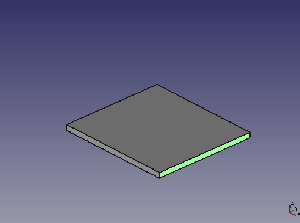
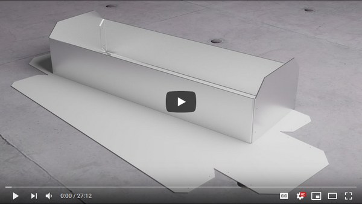
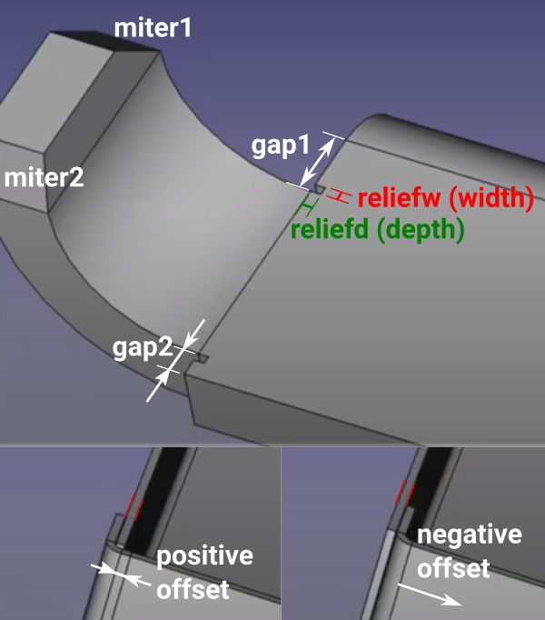
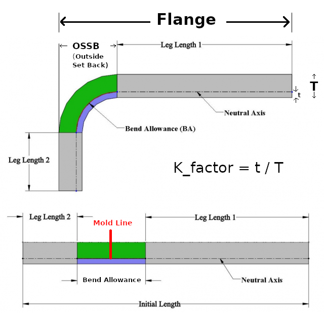

# FreeCAD SheetMetal Workbench

A simple sheet metal tools workbench for FreeCAD

### Tutorial by Joko Engineering:

#### Developers:
* Folding tools:  
  > [@shaise](https://github.com/shaise) Shai Seger  
  > [@jaisekjames](https://github.com/jaisekjames)  
  > [@ceremcem](https://github.com/ceremcem) Cerem Cem ASLAN  
  > ([@JMG1](https://github.com/JMG1)) Based and inspired by Javier Martínez's code
* Unfolding tool:  
  > Copyright 2014 by Ulrich Brammer <ulrich1a[at]users.sourceforge.net> AKA [@ulrich1a](https://github.com/ulrich1a)

# Wiki
[SheetMetal Wiki at FreeCad](https://wiki.freecad.org/SheetMetal_Workbench)

# Terminology 
## Sheetmetal Workbench definitions
  
  
## Physical material definitions
  
  
# Test case 

As a simple test case, consider the following example: 

* Inputs: 
    - Thickness: 2mm  
    - K-factor: 0.38 (ANSI)  
    - Leg length: 48.12mm  
    - Inner effective radius: 1.64mm  
    - Flange length: 51.76mm  
* Output:  
    - End to mold-line distance: 50mm  

You can find a simple calculator in [`tools/calc-unfold.py`](tools/calc-unfold.py). 

# Material Definition Sheet 

### Description 

You can use a Spreadsheet object to declare K-factor values inside the project file permanently. This will allow: 

* Different K-factor values to be used for each bend in your model 
* Sharing the same material definition for multiple objects 

### Usage 

1. Create a spreadsheet with the name of `material_foo` with the following content (see [this table](https://user-images.githubusercontent.com/6639874/56498031-b017bc00-6508-11e9-8b14-6076513d8488.png)):

    | Radius / Thickness | K-factor (ANSI) | 
    | ---| ---| 
    | 1 | 0.38 | 
    | 3 | 0.43 | 
    | 99 | 0.5 | 
    
    Notes: 
    
    1. The cell names are case/space sensitive.
    2. Possible values for `K-factor` is `K-factor (ANSI)` or `K-factor (DIN)`. 
    3. `Radius / Thickness` means `Radius over Thickness`. Eg. if inner radius is `1.64mm` and material thickness is `2mm` then `Radius / Thickness == 1.64/2 = 0.82` so `0.38` will be used as the K-factor. See [lookup.py](https://github.com/ceremcem/FreeCAD_SheetMetal/blob/k-factor-from-lookup/lookup.py#L46-L68) for more examples.

2. Use "Unfold Task Panel" to assign the material sheet.
3. Unfold as usual.

### Screencast
 
 
# Engineering Mode 

### Description

Some sort of parameters effect the fabrication process but are impossible to inspect visually, such as K-factor, which makes them susceptible to go unnoticed until the actual erroneous production took place. 

In engineering mode, such "non-visually-inspectable" values are not assigned with default values and explicit user input is required. "Engineering mode" is a safer UX mode for production environments. 

### Activating 

1. Switch to SheetMetal WB at least once.
2. Edit -> Preferences -> SheetMetal 
3. Select `enabled` in `Engineering UX Mode` field.

# Installation
For installation and how to use, please visit:  
http://theseger.com/projects/2015/06/sheet-metal-addon-for-freecad/  
Starting from FreeCAD 0.17 it can be installed via the [Addon Manager](https://github.com/FreeCAD/FreeCAD-addons) (from Tools menu)

#### References
* Development repo: https://github.com/shaise/FreeCAD_SheetMetal  
* FreeCAD wiki page: https://www.freecadweb.org/wiki/SheetMetal_Workbench  
* Authors webpage: http://theseger.com/projects/2015/06/sheet-metal-addon-for-freecad/  
* FreeCAD Forum announcement/discussion [thread](https://forum.freecadweb.org/viewtopic.php?f=3&t=60818) 

#### Release notes: 
* V0.4.11 07 Apr 2024:  Make material preservation system a bit more robust.  
* V0.4.10 31 Mar 2024:  Some code refactoring and cleanup by [@sliptonic][sliptonic].  
                      - Add Flat shape to base shapes.  
* V0.4.09 28 Mar 2024:  Enhance bend function to work on refined faces as well.  
* V0.4.08 27 Mar 2024:  Add option to set origin of base shape.  
* V0.4.07 26 Mar 2024:  Fix Translation issues by [@hasecilu][hasecilu].  
                      - Update function names to match the wiki help by [@hasecilu][hasecilu].  
* V0.4.06 22 Mar 2024:  Fix SolidBend function to be more robust and autodetect thickness.  
                      - Fix issues with auto-miter not working in some cases.  
* V0.4.05 20 Mar 2024:  Update all other sheetmetal icons by [@maxwxyz][maxwxyz].  
* V0.4.04 18 Mar 2024:  Change main icon to comply with freecad's theme by [@maxwxyz][maxwxyz] and [@pierreporte][pierreporte].  
                      - Fix base shape UI's minimum values.  
* V0.4.03 10 Mar 2024:  Add Spanish translation by [@hasecilu][hasecilu].  
                      - Update translation script by [@hasecilu][hasecilu].  
                      - Set fold direction by selected edge position 
* V0.4.02 21 Feb 2024:  Update bend sketch tooltip by [@Syres916][Syres916].  
* V0.4.01 10 Feb 2024:  Fix basic shape dimensions by [@RexLinz][RexLinz].  
* V0.4.00 27 Jan 2024:  Relicense SheetMetal WB from GPL3 to LGPL2 by [@prokoudine][prokoudine].  
* V0.3.16 17 Jan 2024:  Compatability with python 3.11 by [@Syres916][Syres916].  
                      - Remove debug libraries by [@Syres916][Syres916].  
* V0.3.15 10 Jan 2024:  Unfold compatability with old freecad versions by [@ksigurdur][ksigurdur].  
* V0.3.14 04 Jan 2024:  Fix export of dxf.  
* V0.3.13 10 Dec 2023:  update polish translations by [@kaktusus][kaktusus].  
* V0.3.12 11 Nov 2023:  Fix duplicate lines in unfold sketches issue #284.  
* V0.3.11 11 Nov 2023:  Fix broken engineering mode. Some unfold gui cleanup.  
* V0.3.10 09 Nov 2023:  Add base Sheetmetal shape tool, proposed by [@blindmessenger][opic82482].  
* V0.3.02 10 Oct 2023:  Add Polish translation by [@kaktusus][kaktusus].  
* V0.3.01 09 Oct 2023:  Add Spanish translation by [@hasecilu][hasecilu].  
* V0.3.00 02 Sep 2023:  Refactoring Unfolder by [@sliptonic][sliptonic].  
* V0.2.63 28 Mar 2023:  Fix further unfolding issue by [@Syres916][Syres916].  
* V0.2.62 24 Mar 2023:  Add translation support + Portuguese translation by [@riqueenz][riqueenz].  
                      - Add dxf/svg export option to unfolder + fix unfolding issue by [@Syres916][Syres916].    
* V0.2.61 01 Jan 2023:  Add option to link all bend radii to base bend radius by [@alexneufeld][alexneufeld].   
* V0.2.60 24 Dec 2022:  Improved unfolding script to better handle chamfers by [[@chappatted][chappatted].   
* V0.2.59 11 Nov 2022:  Make unfolder sketch work with linkstage version by [@Syres916][Syres916].  
                      - Fix refine function when multiple edges selected  
                      - Make unfolder work with counter bore holes by [@chappatted][chappatted]. 
                      - Fix typos by [@luzpaz]luzpaz.  
* V0.2.58 06 Oct 2022:  respect 'midplane' and 'reverse' options by [@alexneufeld][alexneufeld]. 
* V0.2.57 07 Sep 2022:  Fix unfold issue with compound holes by [@chappatted][chappatted]. 
* V0.2.56 04 Aug 2022:  Fix issue #206 (object color changes by every sheetmetal command) by [@Syres916][Syres916]. 
* V0.2.55 03 Aug 2022:  Add more backward compatibility to pr #242 by [@Syres916][Syres916]. 
* V0.2.54 30 Jul 2022:  Fix version 20 compatibility with pr #242 by [@Roy-043][Roy-043].
* V0.2.53 28 Jul 2022:  Fix getBendetail and smExtrude for non-planar connecting faces by [@Roy-043][Roy-043].
* V0.2.52 25 Jul 2022:  Better fix for the UseSubtraction issue. Thank you [@akshimassar][akshimassar]
* V0.2.51 23 Jul 2022:  Several fixes and new features: Thank you all!
  * Add Length Spec feature to set adaptive flange lengths by [@rmu75][rmu75].
  * Fix smExtrude for cylindrical connecting faces by [@Roy-043][Roy-043].
  * Fix Face.UseSubstraction typo by [@mangelozzi][mangelozzi].
* V0.2.50 09 Jul 2022:  Moved 'Drawing' to 'TechDraw' for FC0.21 compatibility. Thank you!
* V0.2.49 03 Jul 2021:  Add SubShapeBinder as source by [@s-light][s-light]. Thank you!
* V0.2.48 02 May 2021:  Add context menu [@jaisejames][jaisejames]. Thank you!
* V0.2.47 24 Feb 2021:  Add translation support by [@jaisejames][jaisejames]. Thank you!
* V0.2.46 31 Jan 2021:  Small bug fixes and code clean by [@jaisejames][jaisejames]. Thank you!
* V0.2.45 24 Dec 2020:  Added punch tool feature by [@jaisejames][jaisejames]. Thank you!
* V0.2.44 19 Dec 2020:  Added extend feature by [@jaisejames][jaisejames]. Thank you!
* V0.2.43 01 Dec 2020:  Added corner feature and map sketch to cut openings by [@jaisejames][jaisejames]. Thank you!
* V0.2.42 09 Jun 2020:  Added Engineering UX Mode by [@ceremcem][ceremcem]. Thank you!
* V0.2.41 01 Jun 2020:  Added Drop down Menu
* V0.2.40 24 May 2020:  Added added tools for conversion of solid corners to sheetmetal by [@jaisejames][jaisejames]. Thank you!
* V0.2.34 09 Mar 2020:  Rename "my commands" context menu to sheet metal
* V0.2.33 09 Mar 2020:  Fix bend radius bug on sketch bends. Thank you Léo Flaventin!
* V0.2.32 02 Jan 2020:  Python 3.8 update by [@looooo][lorenz]. Thank you!
* V0.2.31 24 Apr 2019:  Added better K factor control by [@ceremcem][ceremcem]. Thank you!
* V0.2.30 30 Mar 2019:  Added Fold-on-sketch-line tool by [@jaisejames][jaisejames]. Thank you!
* V0.2.22 24 Jan 2019:  Fix some typos, Issue [#54][54]
* V0.2.21 20 Jan 2019:  Fix some typos, Issue [#52][52]
* V0.2.20 10 Jan 2019:  Added sheetmetal generation from base wire by [@jaisejames][jaisejames]. Thank you!
* V0.2.10 01 Nov 2018:  Merge new features by [@jaisejames][jaisejames]. Thank you!  
  * Added Edge based selection
  * Added Auto-mitering
  * Added Sketch based Wall
  * Added Sketch based Guided wall
  * Added Relief factor
  * Added Material Inside, thk inside, Offset options
* V0.2.04 21 Sep 2018:  Fix K-Factor bug
* V0.2.03 20 Sep 2018:  Merge [@easyw][easyw] PR: Add separate color for inner sketch lines. (issue [#46][46]). Change Gui layout
* V0.2.02 15 Sep 2018:  Add color selection for unfold sketches (issue [#41][41])
* V0.2.01 15 Sep 2018:  
  * Fix bug when not generating sketch (issue [#42][42])  
  * Support separate color for bend lines (issue [#41][41])  
* V0.2.00 04 Sep 2018:  Make SheetMetal compatible with Python 3 and QT 5
* V0.1.40 20 Aug 2018:  Merge [Ulrich][ulrich]'s V20 unfolder script - supports many more sheet metal cases and more robust
* V0.1.32 25 Jun 2018:  New feature: Option to separately unfold bends. Thank you [@jaisejames][jaisejames]!
* V0.1.31 25 Jun 2018:  Support ellipses and parabolas, Try standard sketch conversion first
* V0.1.30 25 Jun 2018:  
  * New feature: Generate unfold sketch with folding marks. Issue [#33][33]. Thank you [@easyw][easyw]!  
  * New feature: K-Factor foe unfolding is now editable. Issue [#30][30]  
* V0.1.21 19 Jun 2018:  Fixed back negative bend angles, restrict miter to +/- 80 degrees
* V0.1.20 19 Jun 2018: (Thank you [@jaisejames][jaisejames] for all these new features!!)
  * Add bend extension to make the bended wall wider  
  * Add relief shape selection (rounded or flat)  
  * Double clicking on a bent in the tree view, brings a dialog to select different faces (good when editing the base object breaks the bend, and new faces need to be selected)  
  * Setting miter angle now works with unfold command  
* V0.1.13 10 May 2018:  Change unbending method so shape refinement can work.
* V0.1.12 25 Mar 2018:  Allow negative bend angles. Change XPM icons to SVG
* V0.1.11 01 Feb 2018:  Fix Issue [#23][23]: when there is a gap only on one side, an extra face is added to the other
* V0.1.10 11 Nov 2017:  Add miter option to bends. By [@jaisejames][jaisejames]
* V0.1.02 22 Jun 2017:  Fix nesting bug, when saving and loading file
* V0.1.01 03 Mar 2017:  Support version 0.17 (starting from build 10423)
* V0.0.13 07 Sep 2015:  Add negative gaps for extrude function. (per deveee request)
* V0.012  07 Sep 2015:  Fix issue submitted by deveee
* V0.010  13 Jun 2015:  Add [Ulrich][ulrich]'s great unfolding tool. Thanks!!!
* V0.002  12 Jun 2015:  Fix Save/Load issues  
* V0.001  11 Jun 2015:  Initial version

[lorenz]: https://github.com/looooo
[ulrich]: https://github.com/ulrich1a
[ceremcem]: https://github.com/ceremcem
[jaisejames]: https://github.com/jaisekjames
[easyw]: https://github.com/easyw
[s-light]: https://github.com/s-light
[rmu75]: https://github.com/s-light
[Roy-043]: https://github.com/Roy-043
[mangelozzi]: https://github.com/mangelozzi
[akshimassar]: https://github.com/akshimassar
[Syres916]: https://github.com/Syres916
[chappatted]: https://github.com/chappatted
[alexneufeld]: https://github.com/alexneufeld
[luzpaz]: https://github.com/luzpaz
[riqueenz]: https://github.com/riqueenz
[sliptonic]: https://github.com/sliptonic
[hasecilu]: https://github.com/hasecilu
[kaktusus]: https://github.com/kaktusus
[ksigurdur]: https://github.com/ksigurdur
[prokoudine]: https://github.com/prokoudine
[RexLinz]: https://github.com/RexLinz
[maxwxyz]: https://github.com/maxwxyz
[pierreporte]: https://github.com/pierreporte
[topic82482]: https://forum.freecad.org/viewtopic.php?t=82482
[30]: https://github.com/shaise/FreeCAD_SheetMetal/issues/30
[33]: https://github.com/shaise/FreeCAD_SheetMetal/issues/33
[41]: https://github.com/shaise/FreeCAD_SheetMetal/issues/41
[42]: https://github.com/shaise/FreeCAD_SheetMetal/issues/42
[46]: https://github.com/shaise/FreeCAD_SheetMetal/issues/46
[52]: https://github.com/shaise/FreeCAD_SheetMetal/issues/52
[54]: https://github.com/shaise/FreeCAD_SheetMetal/issues/54

## License
GPLv3 (see [LICENSE](LICENSE))
